# Similarity API

## Funcionalidades
- [x] Signin with Google (OAuth2)
- [x] Light/Dark Theme
- [x] Dropdown Menu
- [x] Toast Notifications
- [x] Code Snippets animation
- [x] Tables
- [x] Authentication
- [x] DB, Caching
- [x] OpenAI API Consumption

## Tecnologías
- NextJS
- React
- TailWindCSS
- Google RestAPI (OAuth2)
- Prisma (ORM)
- Upstash (Redis)
- PlanetScale (Serverless MySQL DB)
- OpenAI Text Similarity (Embedding Vectors)

## Descripción

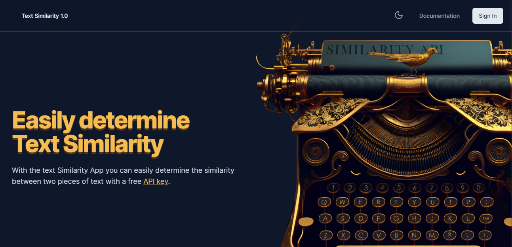

Esta aplicación expone una API para evaluar la similitud de dos cadenas de texto. Primero se debe iniciar sesión con una cuenta de Google y luego generar una API Key que debe ser utilizada en cada petición HTTP para realizar las consultas a la API. Se pueden generar o revocar las API Keys y se registra un historial del uso que se le ha dado a la API Key activa, solo puede estar activa una única API Key a la vez. Una consulta a la API consta de dos cadenas de texto de longitud máxima de 1000 caracteres y mediante el servicio de OpenAI se analizan para determinar su similitud.

Más información de Similarity:
- [OpenAI Embeddings](https://openai.com/blog/introducing-text-and-code-embeddings)
- [Google Embeddings](https://developers.google.com/machine-learning/clustering/similarity/measuring-similarity)
 

## Resultado

### Signin

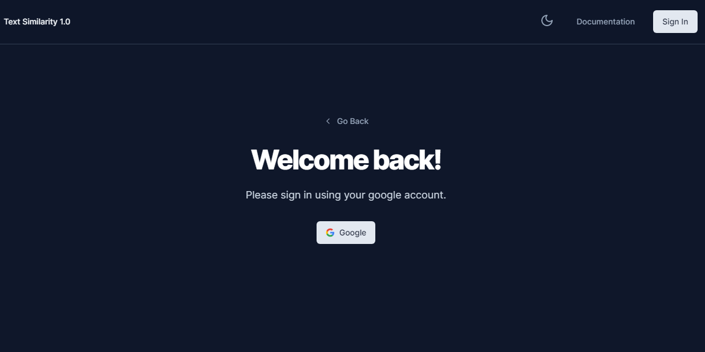

### Documentation

Code Snippet Animation

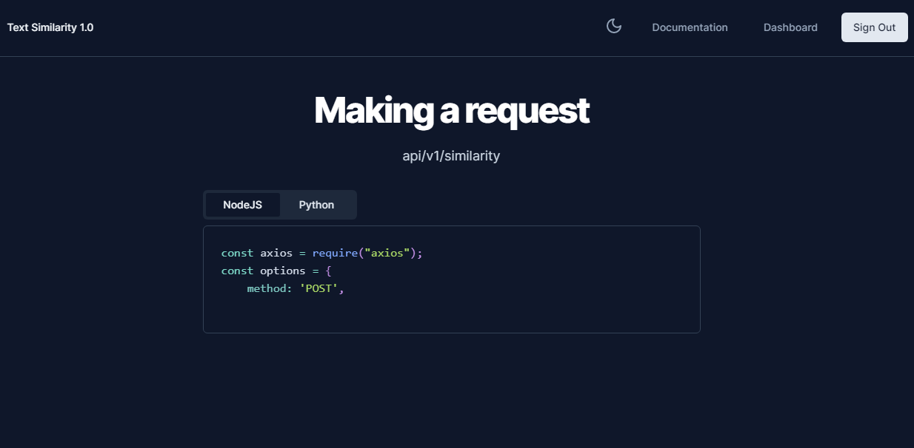

 

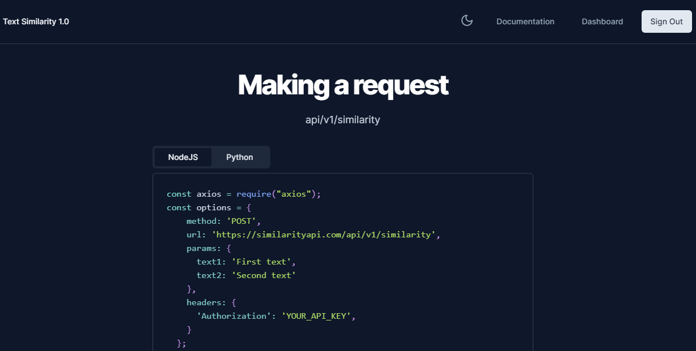

 

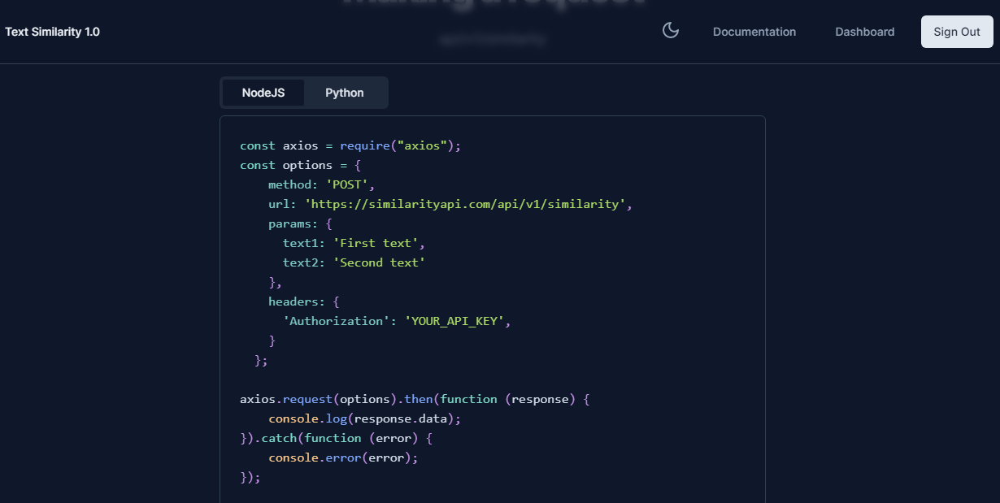

### Dashboard

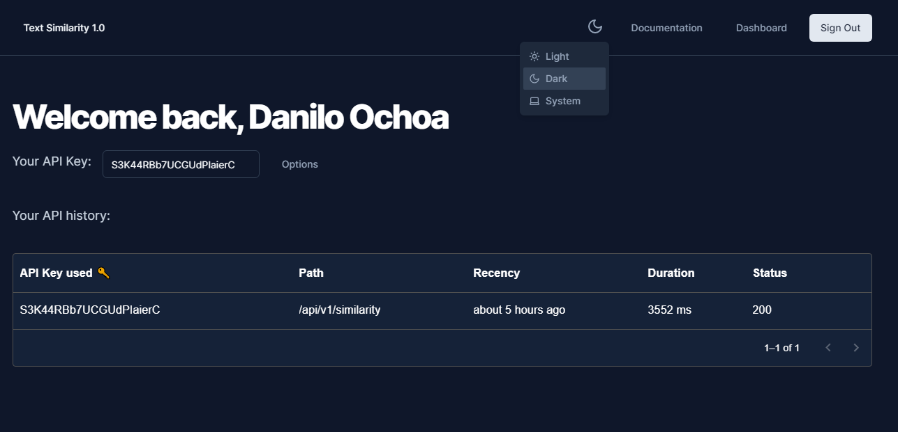

### Dashboard (LightTheme)

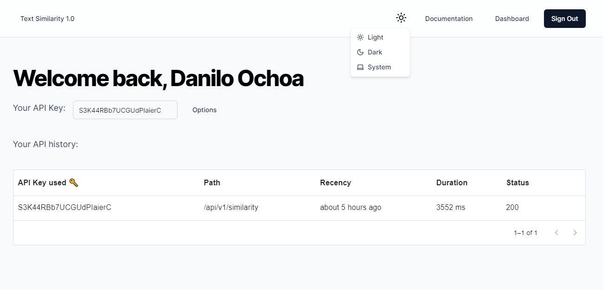

### API Consumption

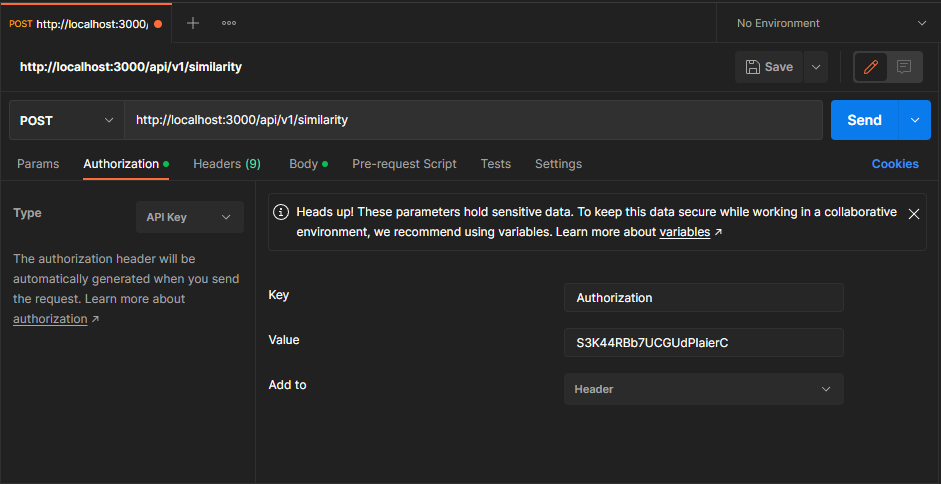

 

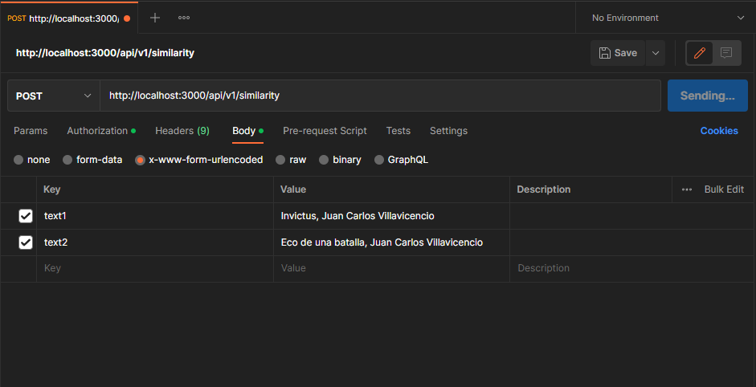

 

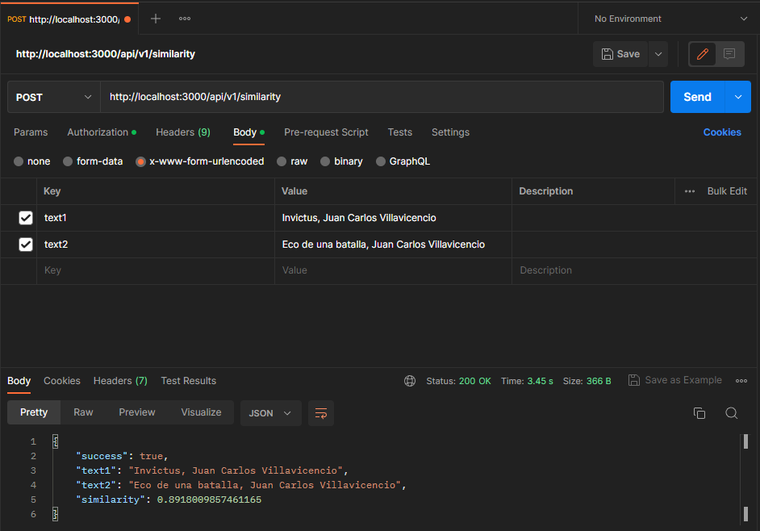

 

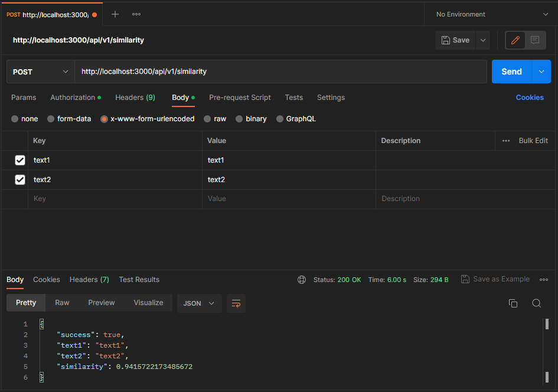

 

## Versionamiento

(Tiber) **Abril 2023 v1.0.0**
* Login
* Logout
* API Key generation
* API Key revok
* Similarity Text Analysis